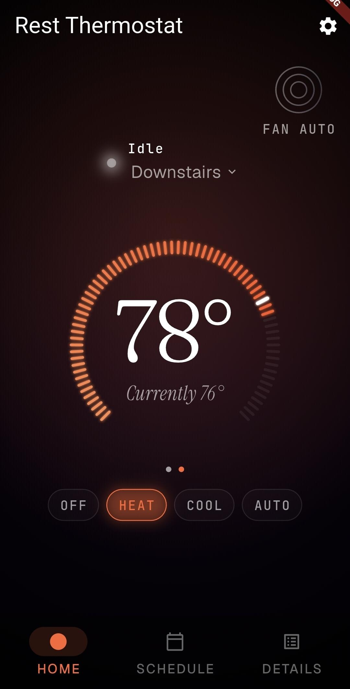
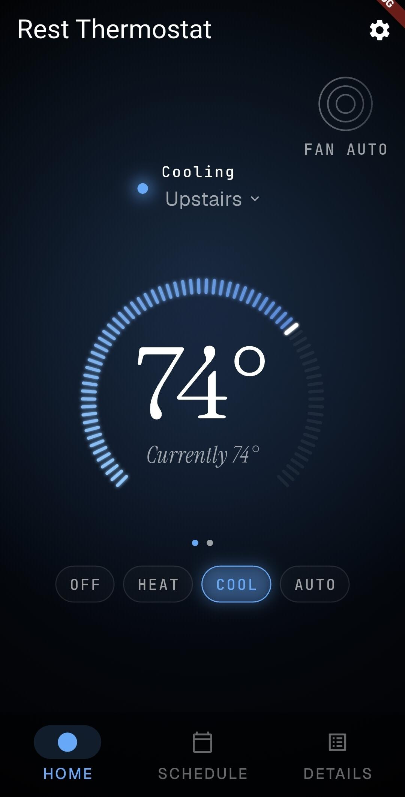
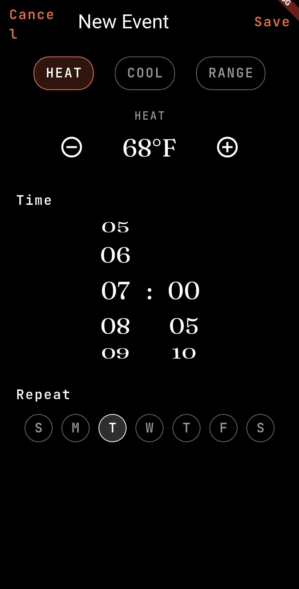
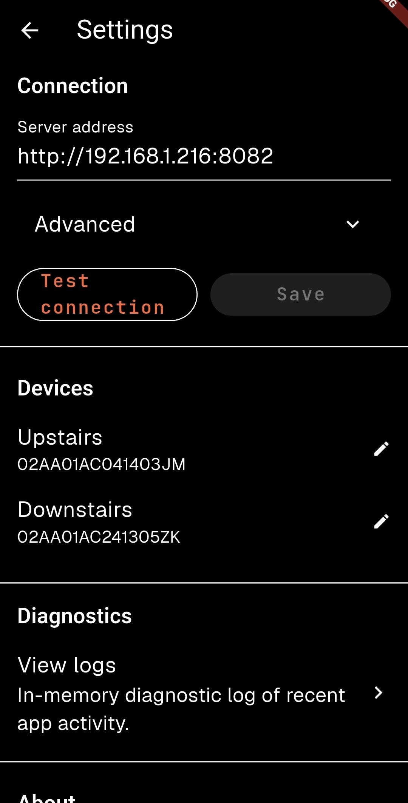

# Rest Thermostat

**Your thermostat. Your server. Your control.**

A community-built Flutter app for the
[NoLongerEvil](https://docs.nolongerevil.com) firmware on deprecated Nest
Gen 1 and Gen 2 thermostats. Rest Thermostat talks to *your* self-hosted
NLE server over HTTP — no cloud account, no telemetry, no subscription.

> Built for [Cody Kociemba's NoLongerEvil project](https://docs.nolongerevil.com).
>
> **Important: this project does not use the Nest or Google trademarks,
> assets, or design language anywhere.** It is an independent client for
> a community firmware project.

---

## Screenshots

<!-- TODO(maintainer): add screenshots once device is available. Capture home (heating + cooling), schedule, and settings from a real device or iOS Simulator; store under docs/screenshots/. -->

| Home (heating) | Home (cooling) | Schedule | Settings |
| --- | --- | --- | --- |
|  |  |  |  |

---

## Why does this exist?

In 2025 Google
[ended cloud service for first- and second-generation Nest Learning
Thermostats](https://support.google.com/googlenest/answer/16233096),
turning otherwise-working hardware into dumb thermostats. The community
[NoLongerEvil](https://docs.nolongerevil.com) firmware, by Cody
Kociemba, replaces the cloud component with a self-hosted server, giving
those devices a second life entirely under their owners' control.

NoLongerEvil ships a web UI of its own. Rest Thermostat is an
**unofficial, community** native mobile client that talks to the same
server. Goals:

- A first-class Android and iOS experience for day-to-day control.
- Multi-device support for households with more than one thermostat.
- Zero dependence on any cloud service — yours or anyone else's.
- An Ember-themed visual identity that deliberately does **not** mimic
  Nest's design language.

Audience expectations: you already have NoLongerEvil running on your own
hardware (a Raspberry Pi, NAS, home server, etc.) and at least one paired
Gen 1 or Gen 2 thermostat. If you're not there yet, start with the
[NoLongerEvil docs](https://docs.nolongerevil.com).

---

## Prerequisites

- An NLE self-hosted server, reachable over HTTP from your phone (LAN,
  VPN, or reverse proxy). See <https://docs.nolongerevil.com>.
- At least one Nest Gen 1 or Gen 2 thermostat already paired to that NLE
  server.
- Android 7.0+ or iOS 14+.

---

## Installation

### Android (recommended: sideload from GitHub Releases)

1. Open the [latest release](https://github.com/MikeSiekkinen/RestThermostat/releases/latest)
   on your Android device.
2. Download the `rest-thermostat-vX.Y.Z.apk` asset.
3. The first time you install from outside the Play Store, Android will
   prompt you to allow installs from your browser (or file manager). Tap
   **Settings**, enable "Allow from this source", and return to the
   install prompt.
4. Tap **Install**. After install, you can disable the
   "Allow from this source" toggle again — it's only needed during
   install.

### iOS (build from source)

Rest Thermostat is not on the App Store. iOS users build and sign the
app themselves on a Mac with Xcode.

A short version:

```sh
git clone https://github.com/MikeSiekkinen/RestThermostat.git
cd RestThermostat
flutter pub get
cd ios && pod install && cd ..
flutter run --release        # with an iPhone/iPad connected
```

You will need to set a Team and a unique Bundle Identifier in Xcode
(`open ios/Runner.xcworkspace`). Apps signed with a free Apple ID expire
after 7 days; [AltStore](https://altstore.io/) can refresh them
automatically.

**Full step-by-step instructions, including signing, AltStore, and
common gotchas:** [`docs/IOS_BUILD.md`](docs/IOS_BUILD.md).

---

## Configuration

On first launch you'll go through a short onboarding flow:

1. **Server URL.** Enter your NLE server (e.g. `http://192.168.1.50:8082`
   or `https://nle.example.com`). The app accepts bare hosts, hosts with
   ports, and full URLs.
2. **Optional auth.** If your NLE server sits behind a reverse-proxy with
   HTTP Basic auth, you can enter credentials here. They're stored in the
   OS keychain (`flutter_secure_storage`).
3. **Pick a device.** Rest Thermostat lists every thermostat paired to
   the server. Choose one to start with; the rest are reachable later
   from the device switcher.
4. **Connected.** You're in.

You can re-edit the server URL, change device names, view logs, or
disconnect at any time from **Settings**.

---

## Building from source

```sh
# Flutter SDK: see pubspec.yaml for the pinned range (currently >=3.24.0 <4.0.0).
flutter --version
flutter pub get
flutter run                  # debug build on a connected device or emulator
flutter build apk --release  # signed Android release (needs android/key.properties)
flutter build ipa --release  # iOS release IPA (Mac only; see docs/IOS_BUILD.md)
```

Useful checks before opening a PR:

```sh
flutter analyze
flutter test
dart format --output=none --set-exit-if-changed .
```

CI runs the same three on every pull request.

---

## Contributing

Issues and pull requests are welcome.

- Browse open work on the
  [issue tracker](https://github.com/MikeSiekkinen/RestThermostat/issues).
- For bigger changes, please open an issue first so we can align on scope
  before you write code.
- Keep commits focused; CI must be green
  (`flutter analyze` + `flutter test` + `dart format`).
- Architectural decisions and conventions live in
  [`docs/DESIGN.md`](docs/DESIGN.md). Read that first.
- Product scope is documented in [`docs/PRD.md`](docs/PRD.md). When PRD
  and DESIGN disagree, DESIGN wins — see DESIGN §18.

---

## License

[MIT](LICENSE). Copyright (c) 2026 Mike Siekkinen and contributors.

---

## Links

- Repository: <https://github.com/MikeSiekkinen/RestThermostat>
- Issue tracker: <https://github.com/MikeSiekkinen/RestThermostat/issues>
- Releases: <https://github.com/MikeSiekkinen/RestThermostat/releases>
- NoLongerEvil project: <https://docs.nolongerevil.com>
- Changelog: [CHANGELOG.md](CHANGELOG.md)
